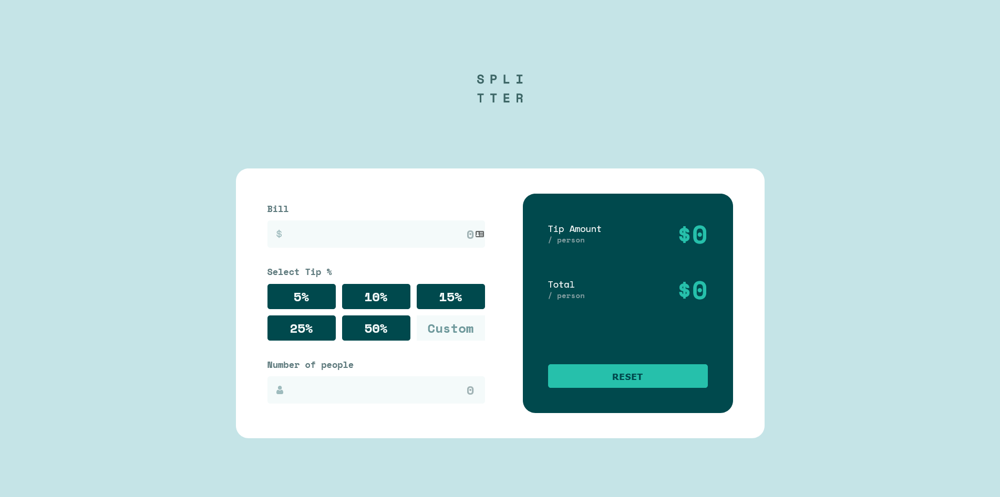

# Frontend Mentor - Tip calculator app solution

This is a solution to the [Tip calculator app challenge on Frontend Mentor](https://www.frontendmentor.io/challenges/tip-calculator-app-ugJNGbJUX). Frontend Mentor challenges help you improve your coding skills by building realistic projects.

## Table of contents

- [Overview](#overview)
  - [The challenge](#the-challenge)
  - [Screenshot](#screenshot)
  - [Links](#links)
- [My process](#my-process)
  - [Built with](#built-with)
- [Author](#author)

## Overview

### The challenge

Users should be able to:

- View the optimal layout for the app depending on their device's screen size
- See hover states for all interactive elements on the page
- Calculate the correct tip and total cost of the bill per person

### Screenshot



### Links

- Solution URL: [Frontendmentor](https://www.frontendmentor.io/solutions/solution-using-sass-and-js-tdI3Ck8VJ)
- Live Site URL: [Netlify](https://tipcalculatorrrr.netlify.app/)

## My process

### Built with

- HTML 5
- Sass
- Grid
- Flexbox
- Javascript

### What I learned

- I have learned how to add a custom field within radio buttons. So when it the costum field is on focus, then the radio buttons are not checked anymore

```js
customPercentage.onfocus = function () {
  percentages.forEach((x) => {
    if (x.checked) {
      x.checked = false;
    }
  });
};
```

- I have learned that the label needs to be after the input in order to make style it when it is checked.

```scss
input[type="radio"]:checked ~ label {
  background: $strongCyan;
}
```

## Author

- Frontend Mentor - [@Nova988](https://www.frontendmentor.io/profile/Nova988)
- Github - [@Nova988](https://github.com/Nova988)
- Twitter - [@A_Nova988](https://twitter.com/A_Nova988)
